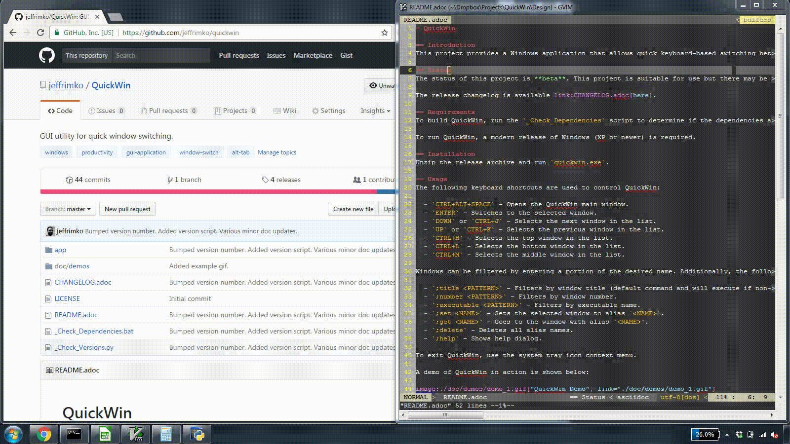

= QuickWin

== Introduction
This project provides a Windows application that allows quick keyboard-based switching between open windows as well as the ability to bookmark frequently used windows for quick return. QuickWin is meant to supplement standard alt-tabbing while providing additional window movement control for those comfortable navigating with a keyboard.

== Status
The status of this project is **inactive**. This project is suitable for use but no new releases are planned. This project is superseded by https://github.com/jeffrimko/PyQuickWin[PyQuickWin].

The release changelog is available link:CHANGELOG.adoc[here].

== Requirements
To build QuickWin, run the `_Check_Dependencies` script to determine if the dependencies are met.

To run QuickWin, a modern release of Windows (XP or newer) is required.

== Installation
Unzip the release archive and run `quickwin.exe`.

== Usage
The following keyboard shortcuts are used to control QuickWin:

  - `CTRL+ALT+SPACE` - Opens the QuickWin main window. If the QuickWin main window is already open, selects the next window in the list.
  - `ENTER` or `CTRL+S` - Switches to the selected window.
  - `DOWN` or `CTRL+J` - Selects the next window in the list.
  - `UP` or `CTRL+K` - Selects the previous window in the list.
  - `CTRL+H` - Selects the top window in the list.
  - `CTRL+L` - Selects the bottom window in the list.
  - `CTRL+M` - Selects the middle window in the list.
  - `CTRL+E` or `CTRL+SPACE` - Jump between windows of same executable.
  - `SPACE` - If no other text is in the command text field, jump between windows of the same executable.

Windows can be filtered by entering a portion of the desired name. Additionally, the following commands can be entered into the text field:

  - `;title <PATTERN>` - Filters by window title (default command and will execute if non-command text is entered).
  - `;number <PATTERN>` - Filters by window number.
  - `;executable <PATTERN>` - Filters by executable name.
  - `;set <NAME>` - Sets the selected window to alias `<NAME>`.
  - `;get <NAME>` - Goes to the window with alias `<NAME>`.
  - `;delete` - Deletes all alias names.
  - `;help` - Shows help dialog.

To exit QuickWin, use the system tray icon context menu.

A demo of QuickWin in action is shown below:

== Roadmap
There are plans to eventually port this project to other operating systems besides Windows.

== Similar
The following projects are similar and may be worth checking out:

  - https://github.com/christianrondeau/GoToWindow[GoToWindow]
